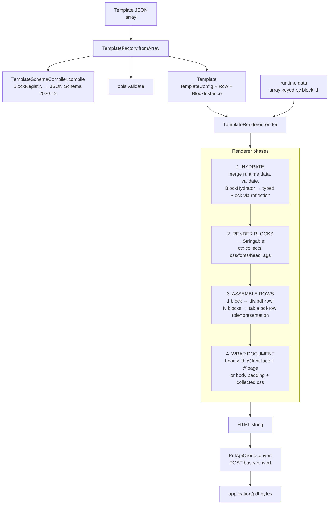

# pdf-ua-client

HTTP client for [`bambamboole/pdf-ua-api`](https://github.com/bambamboole/pdf-ua-api) plus an extensible row/block PDF template engine. Templates are defined as JSON, validated against a JSON Schema 2020-12 document derived via reflection over registered block classes, then rendered to print-ready HTML and posted to the API for PDF conversion.

## Requirements

- PHP `^8.3`
- Laravel `^11 | ^12 | ^13`

## Pipeline



## Quick start

Build and render a template inline:

```php
use Bambamboole\PdfUaClient\Template\TemplateFactory;
use Bambamboole\PdfUaClient\Rendering\TemplateRenderer;
use Bambamboole\PdfUaClient\Http\PdfApiClient;

$template = app(TemplateFactory::class)->fromArray([
    'version' => 1,
    'config'  => ['page' => ['format' => 'A4']],
    'rows'    => [
        ['blocks' => [['type' => 'heading', 'props' => ['text' => 'Hello', 'level' => 1]]]],
    ],
]);

$html = app(TemplateRenderer::class)->render($template);
$pdf  = app(PdfApiClient::class)->convert($html);
```

Register a custom block:

```php
use Bambamboole\PdfUaClient\Attributes\Block as BlockAttr;
use Bambamboole\PdfUaClient\Attributes\Config;
use Bambamboole\PdfUaClient\Block\BlockRegistry;
use Bambamboole\PdfUaClient\Block\RenderContext;
use Bambamboole\PdfUaClient\Contracts\Block;
use Illuminate\Support\HtmlString;
use Stringable;

#[BlockAttr('badge')]
final class BadgeBlock implements Block
{
    public function __construct(
        public readonly string $label,
        #[Config] public readonly string $color = '#2563eb',
    ) {}

    public function render(RenderContext $ctx): Stringable
    {
        return new HtmlString('<span style="color: '.e($this->color).'">'.e($this->label).'</span>');
    }
}

app(BlockRegistry::class)->register(BadgeBlock::class);
```

## Built-in blocks

| Type | Purpose |
|---|---|
| `heading` | h1–h6 headings with align + typography |
| `text` | Multi-paragraph text with align + typography |
| `html` | Escape hatch for raw HTML |
| `image` | `` with alt, max-height, alignment |
| `spacer` | Vertical space (mm) |
| `divider` | `<hr>` with thickness/color/style |
| `key-value` | Label/value table |
| `table` | Generic data table with optional column alignments |

## Schema

The compiled JSON Schema for the template document lives in [`template.schema.json`](./template.schema.json) — committed to the repo so consumers and tooling can reference it without running anything. It's regenerated from the registered block catalog whenever the built-in blocks or configs change.

Regenerate after changing blocks:

```
composer schema
```

The `SchemaFileTest` test guards against drift — it fails if the committed file doesn't match what the compiler would emit right now, so CI catches forgotten regenerations.

To validate a template against the schema in an IDE, point your JSON tooling at the local file or at `https://pdfuakit.com/schemas/pdf-ua-client-template-v1.json` (the `$id` URL).

## Spec viewer

A self-contained HTML viewer for the schema lives at [`viewer/index.html`](./viewer/index.html). Open it directly in a browser (`file://…/viewer/index.html`) or serve it via any static server. The page loads `template.schema.json` and renders it as an expandable tree with cross-references between `$defs` entries.

## Template builder (workbench)

A schema-driven React template builder scaffold lives in the Testbench workbench. It renders the available blocks from the compiled schema and previews a sample template via the PHP render engine.

```
npm install
npm run dev        # in one terminal (Vite dev server)
composer serve     # in another (Testbench app on http://127.0.0.1:8000)
```

The shippable, Inertia-free builder core lives in `resources/js/builder/`; the workbench under `workbench/` is one consumer of its `{ schema, initialTemplate, renderTemplate }` contract.

## Testing

`composer test` runs Pest. Fixture-based rendering tests live at `tests/Fixtures/render/*.php` — each fixture is a PHP file returning a `TestFixture(spec, data, html)`. To refresh fixture HTML after intentional renderer changes, run `UPDATE_FIXTURES=1 composer test`. To refresh `template.schema.json` after intentional block changes, run `composer schema`.

## License

MIT.
